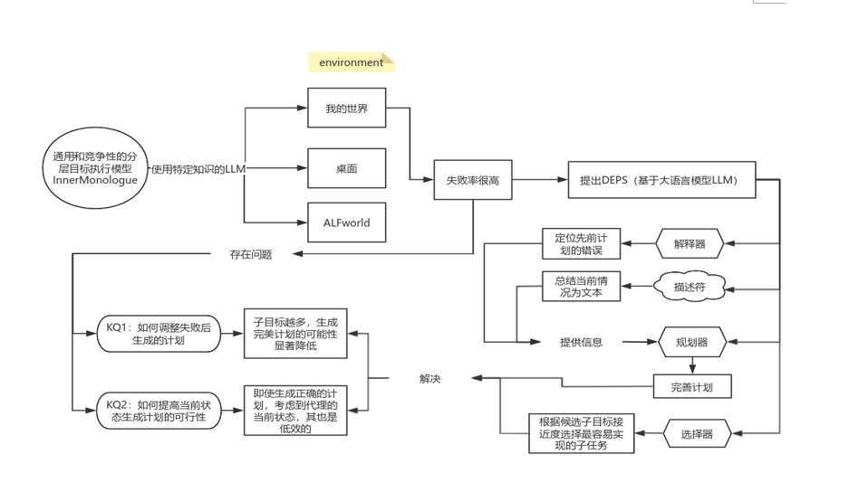
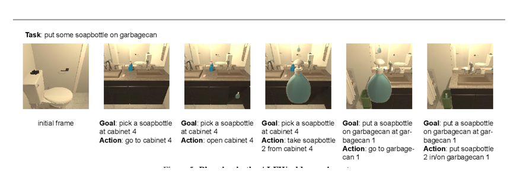
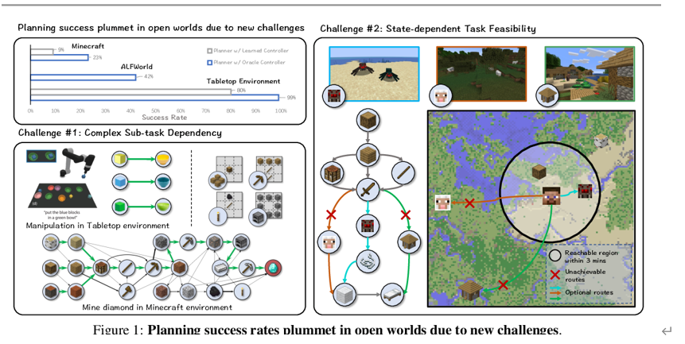
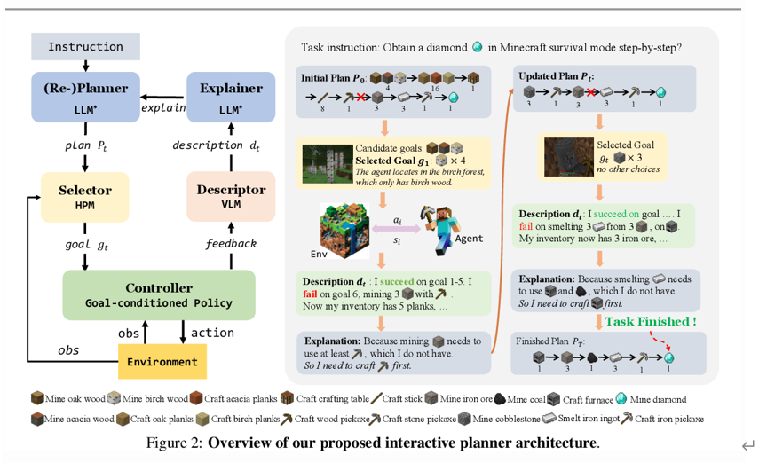
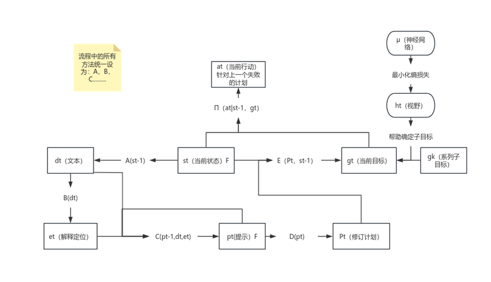
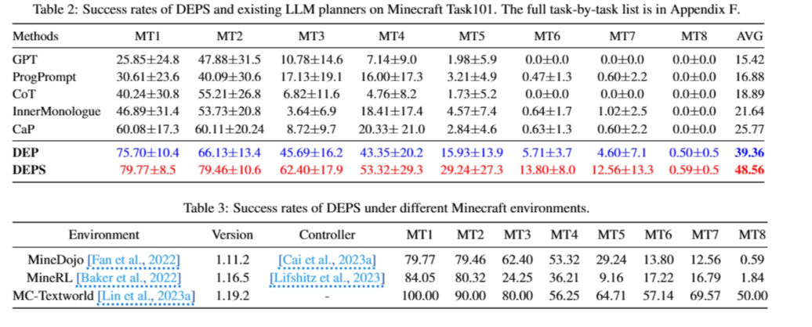
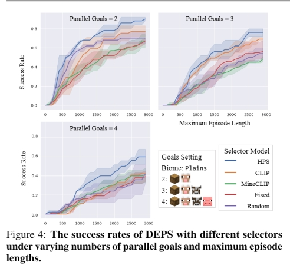
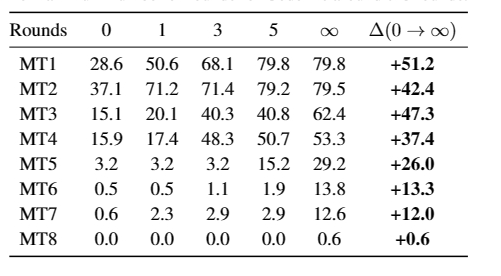

# 
论文精读

## 总览（摘要）
论文中的团队主要研究了在开放世界环境中多任务实体代理的任务规划挑战。确定了两个主要的困难：
1）因为任务的长期性质，在开放世界环境（例如，Mine craft）中执行计划需要准确和多步骤推理。
2）由于普通计划器在复杂计划中排序并行子目标时不会考虑当前代理实现给定子任务的难易程度，因此生成的计划可能效率低下甚至不可行。
为此，提出了基于大型语言模型（LLM）的交互式规划方法“ Describe，Explain，Plan and Select”（DEPS）。DEPS通过描述计划执行过程并提供遇到扩展规划阶段中的失败时的反馈的自我解释，在LLM生成的初始计划上进行更好的错误纠正。此外，它还包括一个目标选择器，这是一个可训练的模块，根据估计的完成步骤对并行候选子目标进行排名，从而优化初始计划。实验标志着第一个多任务代理的里程碑，该代理可以稳健地完成70多个Mine craft任务，并将整体性能提高近一倍。进一步的测试表明，方法在非开放式领域（例如ALF World和桌面操作）中同样有效。
**关键字**：*Open-World（开放世界）, Interactive Planning（交互式规划）, Multi-task Agents（多任务代理）, Large Language Models（大语言模型）, Mine craft（我的世界）*

## 具体问题
1开采钻石（对应问题一）【*当时社区最难问题*】
2制作一张床（对应问题二）【*引申问题*】

首先，与标准环境相比，开放世界具有高度丰富的对象类型和复杂的依赖关系。因此，地面实况计划通常涉及严格依赖的长时间序列子目标。如图1所示的挑战#1表明，为了在《我的世界》中获得钻石，至少需要按顺序执行13个子目标，而在桌面环境中，任务通常不超过几个连续的子目标。
开放世界中复杂任务带来的另一个挑战是所产生计划的可行性。考虑图1中的示例（挑战#2）。要在《我的世界》中制作床，最快的方法是通过屠宰绵羊获得羊毛，可以用羊毛制作床，或从村庄收集床。然而，由于代理在3分钟的游戏时间内无法到达绵羊或村庄，为了高效地制作床，代理应该选择屠宰蜘蛛并使用它掉落的材料（例如绳子)制作羊毛，然后制作床。也就是说，当处理可以通过执行多个可能的子目标序列完成的任务时，规划器应该能够根据代理的当前状态选择最佳路线。然而，开放世界环境的复杂和多样化的状态分布使得状态意识难以实现。
## DEPS
*如下图所示，（DEPS）由一个事件触发的描述器、一个大型语言模型（LLM）作为解释器和规划器、一个基于时延预测的目标选择器和一个目标条件控制器组成。*
 
大型语言模型（LLM）用作代理完成任务的**零样本规划器**。给定一个目标命令（例如，ObtainDiamond）作为**任务T**，基于LLM的规划器将这个高级任务分解为**一系列子目标{g1，...，gK}**，作为**初始计划P0**。这些目标是以**自然语言**给出的指令。然后调用控制器按顺序通过**目标条件策略π(a | s, g)**执行提供的子目标。然而，规划器提供的初始计划往往包含错误，**导致控制器执行失败**。当出现失败时，描述器将**当前状态st**和最近目标的执行结果总结为**文本dt**，并将其发送给LLM。LLM首先通过自我解释尝试**定位前一个计划Pt-1中的错误**。然后，它将重新规划当前任务T并根据解释生成**修订计划Pt**。在此过程中，除了规划器角色外，还将LLM视为解释器。
Description : dt = fDESC(st−1),
Explanation : et = fEX(dt),
Prompt : pt = CONCAT(pt−1, dt, et),
Plan : Pt = fLM(pt),
Goal : gt ∼ fS(Pt, st−1),
Action : at ∼ π(at | st−1, gt)
DEPS将**迭代更新**计划Pt，直到任务完成。其中，fDESC是描述器模型，fLM表示作为解释器和规划器的语言模型，fS是选择器模型，π是来自控制器的目标条件策略。
为了筛选出低效的计划，选择器经过训练以预测在当前状态下实现目标集中的每个目标gk所需的时间步数。当生成的计划包含替代路径时，选择器使用此信息选择一个合适的目标作为当前目标gt。
定义目标的视野**ht(g) := Tg−t**为完成给定目标所需剩余的时间步数，其中**Tg是完成目标g所需的时间**。该度量准确反映了从当前状态开始实现给定目标的速度为了估计视野，**神经网络μ**来拟合离线轨迹，通过**最小化熵损失−log μ(ht(g)|st, g)**，其中ht是完成目标g的地面实时光轨迹。因此，目标分布可以表示如下：

（这里，第一项exp(−μ(gt,st)) 是一个指示函数，它为满足条件的目标变量gt 提供一个权重。第二项是一个累加，它对所有可能的目标变量g的权重进行求和，其中每个权重都是 exp(−μ(g,st))，这是根据某个对数尺度参数μ计算的。

## 实验及其体现出的优势
### 分析与评估实验
* 1.使用通过行为克隆学习的一个控制器来标准化所有实验。（为了让低级控制器引起的性能变化降到最低）（行为克隆是一种模仿学习，模仿学习是指当训练机器人时，通过复制人类的动作，对机器人进行训练，进而达到模仿的目的）
* 2.在minecraft中评估DEPS
**实验设置**：
（1）作者在三个Minecraft环境中进行评估（可更好反应其性能）
（2）作者将71个Minecraft任务分为8个元组（可更好地呈现效果）
（3）作者以成功率作为行动指标
* 3.DEPS与其他基于语言的规划器的比较
**实验设置**：
作者将DEPS与其他基于语言的规划器进行了比较，包括GPT作为零样本规划器（GPT）、ProgPrompt（PP）、思维链 （CoT）、内心独白 （IM） 和代码即策略 （CaP）。这些方法被复制以符合基于提示和反馈模板设计的 Minecraft 规范。 所有规划方法都通过OpenAI API访问LLM模型LLM的所有超参数（包括温度和最佳_of等）保持默认设置，详可见本文附录
* 4.主要结果
（1）作者发现，伴随着任务复杂的增加，规划器需要给出更准确的任务步骤（即更长的目标序列）才能完成最终任务，并导致代理的成功率随着推理步骤的增加而降低，最直观的来看从MT6开始，几乎所有现有的LLM基础规划器都会失败。而DEP已在所有元任务中击败了现有的LLM基础规划器，并且优势显著。这验证了DEP可以估计当前计划失败的原因并纠正原始有缺陷的计划。
（2）选择器也极大地提高了代理的最终任务成功率，在效率敏感任务上带来了显著改进。
* 5.补充：为了测试在不同控制器和不同Minecraft版本上的鲁棒性（**鲁棒性是指 DEPS 方法在不同任务和环境中始终如一地表现良好的能力**）作者还在Min-eRL 和MC-Textworld 上评估了DEPS。而结果显示DEPS可以在各种Minecraft环境中生成有效的计划。
 
注：表中的MT8是挖掘钻石，这作为了一个额外的实验，以展示零样本规划器在嵌入环境中处理复杂任务的能力。在方法并没有专门针对这个挑战进行微调的情况下，DEPS在这个大挑战中取得了相当的性能；代理在10分钟的游戏时间内实现了0.59%的成功率。
### 消融研究实验
**目的**：以研究不同选择器模型的候选可执行目标数量以及DEPS的回合数的具体影响。
#### 选择器的消融
作者主要是要验证所提出的选择器在不同并行目标下的**鲁棒性**，作者报告了使用不同的选择器实现方法（包括使用固定的目标序列、随机的目标序列和基于MineCLIP、CLIP 和作者的预测性选择器（HPS）的选择器）时，不同方法的最终成功率如图下所示，可见使用本文的预测性选择器分别获得了+22.3%、+29.2%和+32.6%的改进。

**结论**：
1. 在有限的剧集长度（剧集长度：指代理在给定任务或剧集中可以采取的预定最大步骤或操作数。）下，目标模型表现出更大的优势，这证明了目标模型可以改善嵌入环境中的计划的执行效率。
2. **预测性选择器**作为**目标模型**比**视觉语言模型**具有更好的性能。
3. 曲线趋势还表明，在开放世界环境中，具有选择器的智能体在大量目标下会扩大规模。
#### 重规划回合的消融
作者将回合定义为交互式LLM基础规划的描述、解释、规划和选择的循环，所有任务的每个最大回合都执行30次，并报告平均成功率，结果如下

注：第 0 轮代表没有重新规划过程的普通计划者。∞表示重新规划过程在任务成功或达到最大值之前不会结束，这仍然受到 LLM 最大令牌的限制。
**结论**：
这组实验表明，DEPS可以在开放世界中迭代地改进其计划。更多的描述、自我解释和重规划回合会产生更好的结果，特别是在困难的任务上。

## DEPS的方法的扩展和延伸
### 部分类似作品的优劣
#### 使用大语言模型进行的任务规划
* 1.Andy Zeng等人（2022）、Ishita Dasgupta等人（2022）、Ran Gong等人（2023）研究利用大型语言模型生成高级任务在具体化环境中的动作计划。
* 2.Huang等人（2022b）通过文本补全和语义翻译将自然语言命令分解为可执行动作序列。
作者表示所有这些方法都假设来自LLM的初始计划是正确的。当初始计划存在错误时，代理很难成功完成任务。
#### 以大语言模型进行的交互式规划
Inner Monologue（Huang等人，2022a）率先尝试了与LLMs的交互式规划，引入了反馈（包括成功检测和场景描述）到规划器中。
本文发现这一方法仍会受到积累规划误差的影响，尤其是在长期开放世界的任务中。作者认为通过本文的（DEPS）方法通过利用思维链思考和解释来定位先前计划中的错误，从而产生更可靠的计划。
此外，作者还提出了一个**目标选择器**来进一步提高计划的效率，从而获得更好的性能。（它考虑每个候选子目标与当前状态的接近程度，并选择最近的目标作为当前目标。这样可以提高代理的整体性能*如本文4.2节所示*）
#### 在“我的世界”中的代理
* 1.Oh等人（2017）、Mao等人（2022）、Lin等人（2021）等先前的工作使用了分层架构来解决Minecraft中的长期任务。
* 2.基于互联网规模的语料库，Fan等人（2022）预训练了一个语言条件奖励函数并学习了多任务MineAgent。
作者表示文中架构中的规划器强调应用领域知识来提出和安排子目标，不是专注于改进低级控制器。这显著影响了代理能够处理的任务的复杂性和广度。此外，我们的规划器是零样本的，可以推广到其他环境。
### 应用中的局限性及其改进方法
#### 局限性一：框架依赖于私有的大语言模型
 作者在文中强调，他们的团队将全力推进更民主的方法的实现，还会探索开源模型的使用，如OPT [Zhang等人，2022]和BLOOM [Scao等人，2022]。
#### 局限性二：明确分布规划阻碍了模型的进一步发展
虽然**明确分布**规划优于**基线规划**（*原因：明确分布规划允许更准确和可靠的计划*），但因为其要对每一个子目标进行详细的规划，这可能很耗时且限制了模型进一步扩大规模。
作者认为在端到端可训练的目标条件策略中摊销计划更值得探讨，这可以解决计划瓶颈并允许进一步的可伸缩性。通过将计划直接集成到目标条件策略中，代理可以学习即时生成计划，而无需明确的分步计划。
#### 注：
一些先前在规划中的基本挑战（*例如死胡同*）在作者的环境中可能并不普遍，因此可能会被本文无意中忽视。作者将致力于解决在构建多任务通用代理方面的更多基本挑战。

## 结论
本文研究了开放世界中的规划问题。作者发现这些环境中存在两个主要挑战：1）长期规划需要精确且多步骤的推理，2）由于典型规划器没有考虑代理与并行目标/子任务的接近程度，规划效率可能会受到影响。我们提出了基于大型语言模型（LLMs）的交互式方法“描述、解释、计划和选择”（DEPS），以解决这两个问题。我们在具有挑战性的Minecraft领域中进行实验，通过完成70多个Minecraft任务并使整体性能几乎翻倍，验证了这个方法相对于其他方法的优势。DEPS也是第一个能够在这个游戏中达到钻石级别的基于规划的代理。

 

