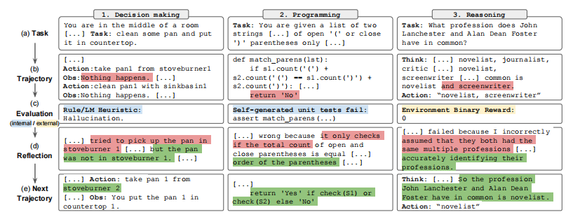
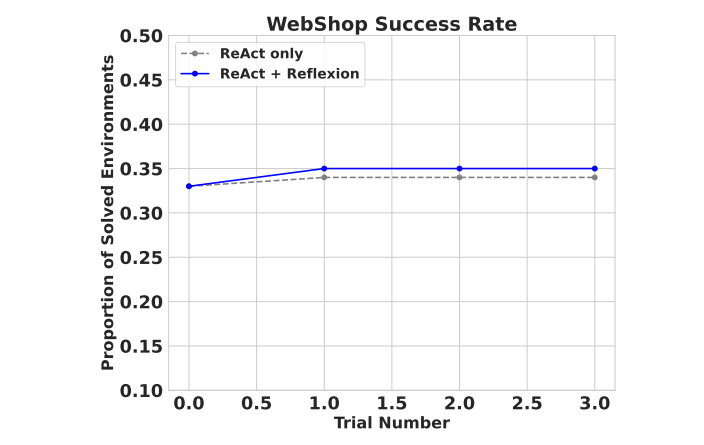

## 1. Reflexion:Language Agents with Verbal Reinforcement Learning
~~~
太长不看版：
这项研究提出了一种“反思”（Reflexion）框架，不同于传统的更新权重来强化智能体（agent），Reflexion框架中的评估器（Evaluator）对短期记忆进行评分并呈递给
自我反思机制（Self-Reflection），进而生成语言反馈存入一个长期记忆组件（mem）中参与下一次的输入。这种循环结构类似人类的记忆学习反思过程，不断强化学习
提高LLM模型的准确率。同时作者从决策制定、推理和编程三个角度展开了实验，并验证了Reflexion的应用在决策制定和推理两个板块对于模型准确率带来的明显提升。而
在编程实验中，Reflexion自带的反思机制使得其自身可以生成测试套件来增强其准确性（在HumanEval代码生成任务中准确率相比GPT-4提高10.9%），但同时作者也发现
该框架存在生成的测试集不稳定、记忆组件仍需扩展、面对探索性及高度创新性问题失效等问题。总的来说，本文提出的Reflexion使得大模型agent能够快速地从错误经验中进行总结学习，并在多个任务上都取得了不错的效果。

~~~

## 2. 摘要

大型语言模型（LLM）越来越多地被用作与外部环境（例如游戏、编译器和API）进行交互的目标驱动代理。然而，对于这些语言智能体（agent）来说，通过试错快速有效地学习仍然具有挑战性，因为传统的强化学习方法需要大量的训练样本和昂贵的模型微调。因此作者提出了一种新颖的框架 “反思”（Reflexion），通过语言反馈而不是更新权重来强化语言智能体。具体而言，Reflexion智能体根据任务反馈信号进行言语反思，然后将自己的反思文本存储在一个情节性记忆缓冲区中，以在后续的尝试中做出更好的决策。Reflexion非常灵活，可以整合各种类型（数量值或自由形式语言）和来源（外部或内部模拟）的反馈信号，并且在不同任务（顺序决策、编码、语言推理）上相对于基准智能体取得了显著的改进。例如，作者发现Reflexion 在HumanEval编码基准测试中达到了91%的一次正确率，超过了之前最先进的 GPT-4 的80%。作者还通过使用不同的反馈信号、反馈整合方法和智能体类型进行了实验和分析研究，并提供了对它们如何影响性能的见解。作者在 https://github.com/noahshinn024/reflexion 上发布了所有的代码、演示和数据集。

## 3. 引言

近期的研究，如ReAct、SayCan、Toolformer、生成式代理和WebGPT等，已经证明了建立在大型语言模型（LLM）核心之上的自主决策智能体的可行性。这些方法利用LLMs生成文本和“行动”，这些行动可以用于API调用并在环境中执行。由于它们依赖具有大量参数的大型模型，因此迄今为止，这些方法一直局限于使用上下文示例来教导智能体，因为传统的优化方案，如使用强化学习和梯度下降，需要大量计算和时间。
在这篇论文中，作者提出了一种名为“反思”（Reflexion）的替代方法，该方法利用言语强化来帮助智能体从之前的失败中学习。Reflexion将环境中的二元（"T"or"F"）或标量反馈转换成文字形式的言语反馈，然后将这种反馈作为额外补充的文段在下一次尝试时添加给大型语言模型智能体（agent）。这种自我反思的反馈作为一种“语义”梯度信号，通过为智能体提供一个具体的改善方向，帮助它从之前的错误中学习，以提高其在后续任务中的表现。
但生成有用的反馈需要归因（理解出错点）和总结能力（生成摘要），作者探索了三种生成反思性反馈的方法：

- 简单的二元环境反馈：这种方法利用基本的成功/失败信号来指示智能体的行为是否达到了目标。这种反馈简单直接，但信息量有限，可能无法提供足够的指导来改进复杂任务的执行。

- 预定义启发式：为常见的失败情况预设一些规则或标准，如果智能体的行为与这些预定义的失败模式匹配，就提供相关的反馈。这种方法比简单的二元反馈提供了更具体的指导，但它的缺点在于需要事先定义各种失败模式，这可能无法覆盖所有的情况或适用于新的、未见过的任务。

- 自我评估：这包括使用大型语言模型进行二元分类（例如决策任务中的是/否判断）或编程任务中编写自身的单元测试。自我评估允许智能体在没有外部反馈的情况下评估自己的表现，从而增强学习和改进的能力。
之后作者又对决策制定任务（测试长期轨迹上的顺序行动选择）、推理任务（测试知识密集型的单步生成改进）和编程任务（教授智能体有效地使用编译器和解释器等外部工具）进行了实验。在这三种类型的任务中，观察到Reflexion智能体在决策制定任务AlfWorld 上比强基线方法在12次迭代学习步骤中改进了绝对22%，在HotPotQA上的推理问题上提高了20%，并且在HumanEval上的Python编程任务上提高了多达11%。

## 4. 相关研究
### 4.1. 推理与决策制定

Self-Refine采用迭代框架进行自我完善，通过自我评估自主改进生成过程。（但Self-Refine仅限于单一生成的推理任务）

进行了类似的语义提示写作优化，对评论模型进行微调，以在轨迹中提供中间反馈来改善推理响应。

利用随机束搜索来执行更高效的决策搜索策略，这允许智能体由于其自我评估组件而具有先见之明。

使用决策模型对多种生成进行推理。

在一定步数内使用重试模式，没有进行评估步骤。 

进行定性评估步骤，提出对之前生成的优化建议。

### 4.2. 编程

AlphaCode对隐藏的测试用例对一组生成进行评估。

CodeT使用自生成的单元测试来评分生成的函数实现。

Self-Debugging采用调试组件，通过代码执行环境的反馈来改进现有的实现。

CodeRL将问题置于 RL 框架中，使用行动者-评论家设置来调试程序，根据执行环境的反馈进行调试。

AlphaCode、Self-Debugging 和CodeRL 在修复较不复杂的程序 BUG 上是有效的，但它们依赖于使 pass@1 符合资格的“ground truth test”测试用例（需要某项任务、数据或系统的真实、准确的测试标准），不使用自我反思来弥合错误识别和改进之间的差距。CodeT不使用隐藏测试用例，但也不会实施自我学习步骤来改进代码编写。

## 5. 反思：通过对语言的反思来进行强化学习

 Reflexion 构建涉及两个重要模型：
 
**Evaluaort**（评估者模型） - 以 ( M_e ) 表示，负责评分 ( M_a ) 生成的输出。Evaluator 的角色是根据某些标准或目标来判定 Actor 输出的质量。它可能利用预定义的标准、历史数据、启发式规则等评估 Actor 的决策和行为。

**Self-Reflection**（自反馈模型） - 以 ( M_sr ) 表示，它负责生成语言反馈信息来辅助 Actor 自我改进。Self-Reflection 模型通过分析整合 Actor 的行为和 Evaluator 的评分来生成反馈，这些反馈可以帮助 Actor 理解其上一步行为的结果，并提供改进方向。

### 5.1. 行动者（actor）

该模型建立在大语言模型（LLM）基础上，围绕策略网络设计，但会同时从当前已习得策略πθ和外界环境两个部分获取信息（πθ中采样行为，环境中接收观察值）。同时作者也对不同的actor模型进行了探索（Chain of Thought && ReAct），使得Reflexion框架下的actor具有多样化的生成模型。而其新增的记忆组件（mem）保证其记住以前的观察和行动，并使用内部或外部的 "记忆" 来改进决策过程。

### 5.2. 评估器（evaluator）

该模型接受Actor生成的轨迹（Trajectory,以其作为短期记忆）作为输入，计算反映其在给定任务环境中表现的奖励分数，评估Actor生成的输出质量。而实际上面对不同的语义环境，哪些输出是有价值的这很难用函数去定义。所以作者研究了几个方向的变体，对评估器采用多方面的设计来完善其评分机制。例如，推理任务中，探索了基于精确匹配（EM）评分的奖励函数。决策任务中，采用预定义的启发式函数。使用LLM本身的不同实例作为评估器，为决策和编程任务生成奖励。

### 5.3. 自我反思（self-reflection）

通过生成语言来为未来的尝试提供有价值的的反馈。例如，给定稀疏的奖励信号（来自evaluator）以及当前的轨迹（短期记忆）和持久的记忆mem，以此来生成细致而具体的反馈，同时这种比标量奖励更具信息量的反馈随后又被存储在智能体（agent）的长期记忆（mem）中，从而进入一个循环不断地迭代学习和积累改进。

### 5.4. 记忆（memory）

短期记忆（Trajectory）和长期记忆（mem）是Reflexion过程的核心组件，轨迹历史作为短期记忆，而自我反思模型的输出存储在长期记忆中，这两个记忆组件共同提供了特定的上下文（语言），在兼顾新探索的同时也保存了先前记忆的信息。

### 5.5. 反思（Reflexion）的过程

Reflexion的执行过程是一个迭代的优化过程，并且遵循下列步骤：
1. 初始化Actor (行动者)、Evaluator (评估者) 和 Self-Reflection (自我反思) 模型：Ma、Me、Msr。
   
2. 初始设定策略 πθ(ai|si)，其中θ包括Ma和记忆模块mem。

3. 使用策略πθ生成初始轨迹τ0。

4. 使用评估者模型Me对τ0进行评估，得到奖励分数r0。

5. 使用自我反思模型Msr生成初始自我反思sr0。

6. 将sr0设置为记忆mem的内容。

7. 设置迭代变量t为0。

8. 当评估者Me没有通过或t小于最大试验次数时，循环执行以下步骤：
   a.	使用策略πθ产生一系列动作和观测组成的轨迹τt。
   b.	使用评估者Me对τt进行评估。
   c.	使用自我反思模型Msr生成自我反思srt。
   d.	将srt附加到记忆mem中。
   e.	t递增。

9. 返回结束时的结果。

在这个过程中，Actor依据短期和长期记忆（由前一轨迹历史和自我反思输出组成）来指导决策。自我反思用于发现错误并更新记忆，之后重置环境并开始新的试验，这样循环进行，直到满足条件或达到最大试验次数。

## 6. 实验

作者在决策、推理和代码生成任务上评估了各种自然语言强化学习（RL）设置。挑战一个智能体（agent）在HotPotQA上进行基于搜索的问答，在AlfWorld中执行常见家庭环境下的多步骤任务，以及在带有解释器和编译器的类比赛环境中进行代码编写任务，使用的环境包括HumanEval、MBPP，以及一个新的基准测试LeetcodeHard。最值得注意的是，Reflexion在AlfWorld上的性能比强基线提高了22%，在HotPotQA上提高了20%，在HumanEval上提高了11%。

### 6.1. 顺序决策（ALFworld）

ALFworld是基于TextWorld的基于文本的任务环境套件，挑战智能体解决多步任务。在这个实验中，智能体（agent）在134个不同的AlfWorld环境中运行，包括寻找隐藏的物体、移动物体和用其他物体操纵物体等六个不同的任务。

#### 6.1.1. 实验结果

实验结果显示，ReAct + Reflexion相比于单独使用ReAct，在检测幻觉和低效规划方面的性能提高显著，完成了134个任务中的130个。此外，ReAct + Reflexion在连续12次试验中学到了解决额外任务的能力。而仅使用ReAct的方法在第6和第7次试验之间性能提升停滞不前。

#### 6.1.2. 实验分析

基准失败的AlfWorld轨迹中常见的错误是智能体认为它拥有一个物品，但实际上并没有。之后智能体继续执行一系列动作，但无法回溯这些动作来找到错误。而使用Reflexion可以几乎消除所有这些情况，通过使用自我反思将长时间失败的轨迹提炼成相关经验，以作为未来的"自我提示"。

### 6.2. 推理（HotpotQA）

HotPotQA是一个基于维基百科的数据集，包含113,000个问题和答案对，挑战智能体（agent）解析内容并对多个文档进行推理。

#### 6.2.1. 实验结果   

结果表明Reflexion胜过了基线方法，表明它通过迭代纠正错误和从经验中学习来提高推理能力的价值。仅ReAct、仅CoT和仅CoT（GT）的实现没有显示明显性改进，这意味着在初步试验中失败的任务在后续试验中仍未得到解决。作者还发现，尽管CoT可以访问问题的基本事实上下文，CoT (GT)智能体无法正确推断出39%的问题的正确答案，但是Reflexion可以帮助智能体纠正错误，无需访问真实答案，并将准确性提高了14%。

#### 6.2.2. 实验分析

作者进行了一个消融实验，以验证自我反思在使用CoT (GT)作为基准方法时对推理的优势。CoT (GT)使用提供的基本事实上下文进行思考，测试了对长上下文的推理能力。研究人员在这个基础上增加了一个情景记忆（Episodic Memory, EPM）的元素。EPM是一种包括最近轨迹（即智能体最近的一系列行动和经验）的记忆组件，它可以被用来增强智能体的学习和推理能力。在CoT和EPM的基础上增加了Reflexion框架的自反思机制，并测试了这种组合方式是否可以提高学习能力。最终的结果表明，在CoT和EPM的帮助下，加入自反思步骤的Reflexion智能体在学习能力上获得了进一步的提升。

### 6.3. 编程

作者对MBPP、HumanEval（问题集）以及新数据集LeetcodeHardGym（包含了40个在GPT-4预训练截止之后发布的Leetcode高难度题目，既是对已有模型技能的挑战，又被用于训练新的模型）上的Python和Rust代码编写进行了基线和Reflexion方法的评估。

MBPP和HumanEval主要评估根据自然语言描述生成函数体的准确性，作者使用名为MultiPL-E的编译器（用于将Python基准问题翻译成其他18种语言）将HumanEval和MBPP的子集翻译成Rust语言，以此来测试Reflexion实现在编程语言生成方面的通用性。

而依托于Reflexion的自我反思机制，其能够生成和运行单元测试来验证代码的正确性。意味着系统不仅生成解决方案（代码），还生成测试这些解决方案的测试用例
而为了生成测试套件

- 作者通过使用**链式推理（Chain-of-Thought）提示**，生成了一个多样性和广泛性的单元测试及其对应的自然语言描述。

- 接着通过尝试为每个提出的测试构建有效的**抽象语法树（AST）**来过滤出语法上有效的测试语句。

- 最后从生成的单元测试中抽取n个测试用例来生成**测试套件T**，标记为{t0, t1, …, tn}，并将n的最大值设置为6个单元测试（保持测试单元的可管理性）。

采用Reflexion机制的编程任务实现具备报告pass@1准确度的资质或条件，因为它在第一次尝试时就能生成高质量的代码，该代码能够通过自动生成的单元测试，从而反映出代码的正确性。

通过以上实验设置，研究人员一方面检验了Reflexion在生成代码方面的跨语言能力，另一方面也对它的自我评估能力进行了探索。

#### 6.3.1. 实验结果

Reflexion在所有基准测试中的准确性都优于所有基线模型，并且在Python和Rust的所有基准测试中树立了新的最先进水平，除了MBPP Python 1之外。

#### 6.3.2. 实验分析

尽管在面对 HumanEval 或类似编程问题集，模型可以在这些问题的条件下生成答案，并依此产生测试数据集，但自我反思的代码生成智能体（agent）很难做到多样性、全面测试，在模型生成一个不稳定的测试套件的情况下，所有测试都可能在一个错误的解决方案上通过，造成错误的判断。

当模型生成了不稳定的测试集时，所有测试可能会错误地在一个不正确的解决方案上通过，进而导致对代码完成的**错误正面标记**（FP）。同样，如果模型生成了错误编写的测试集，一些测试可能在正确的解决方案上失败，导致基于**错误负面代码**（FN）完成的自我反思生成。因为智能体可能能够自我反思来识别错误的测试，并提示自己做出改变。同时如果一个无效的测试集返回**错误的正面结果**（FP）（所有内部测试用例通过但实现不正确），智能体（agent）会过早的存入这个存在错误的结果。

实施了Reflexion技术后，因为智能体（agent）可以利用自我反思机制识别并修正存在错误的测试，所以**错误的负面结果**（FN）往往比**错误的正面结果**（FP）更有利于智能体做出正确判断。

不同测试平台上也存在性能差异。对比HumanEval和MBPP Python的基线通过率第一次准确性相似，但MBPP Python有较高的错误的正面测试（FP）执行率（MBPP Python的错误正面测试执行率为16.3%，而HumanEval Python仅为1.4%），所以在其上应用的Reflexion框架并未收获性能的提升。

#### 6.3.3. 消融研究

研究者进行了一项消融研究，以测试Reflexion在测试生成和自我反思合作方面的综合方法，并将其应用于一些极具挑战性的HumanEval Rust编程问题。他们的研究发现，如果省略了测试生成和执行步骤，智能体的准确率（52％）会低于基线的性能（60％），表明智能体需要单元测试来验证代码实现的正确性。然后，研究者去除了失败的单元测试后自然语言解释的步骤，结果表明这种情况下智能体的性能并没有改进（仍为60％）。这说明了仅仅通过测试生成和代码编译来捕获错误是不够的，还需要通过自我反思来指导修改。通过这些发现，他们仅依靠盲目尝试和错误的调试技术而不进行自我反思，在解决复杂编程任务时是低效的。

## 7. 局限性

本质上，Reflexion是一种利用自然语言进行策略优化的优化技术，策略优化是通过经验改进行动选择的一种强大方法，但它仍然可能**陷入非最优局部最小解**，Reflexion的**记忆组件还可以进行拓展**。

除此之外，**Reflexion在解决需要高度多样性和探索性的任务方面表现不佳**。在使用Reflexion的ReAct+Reflexion agent进行的WebShop实验中（一个基于网络的问题解决标准测试），该技术未能展现出足够的进步，agent在失败后也未能产生有用的自我反思。

相比之下，在AlfWorld环境中，因为它能够明确观察到可执行的动作，agent表现得更好。

在执行HotPotQA测试时，尽管面对类似WebShop的搜索任务，由于维基百科文章的搜索空间更加多样化，且对搜索查询的准确性要求不高，Reflexion agent仍是成功的。

对于WebShop，在电子商务搜索中正确处理自然语言搜索解释中的歧义是极其重要的。说明Reflexion框架无法正确的理解较复杂的自然语言，也因此self-reflection机制无法生成具有参考价值的语言摘要来促进agent行为的更新。

## 8. 结论

在这项工作中，作者介绍了“反思”（Reflexion），一种利用语言强化学习来教导智能体（agent）程序从过去的错误中学习的方法。并凭经验证明，通过利用自我反思，Reflexion智能体明显优于目前广泛使用的决策方法。在未来的工作中，Reflexion可以用于应用在传统强化学习环境中已经深入研究过的更先进的技术，例如自然语言中的价值学习或者脱策略探索技术。

